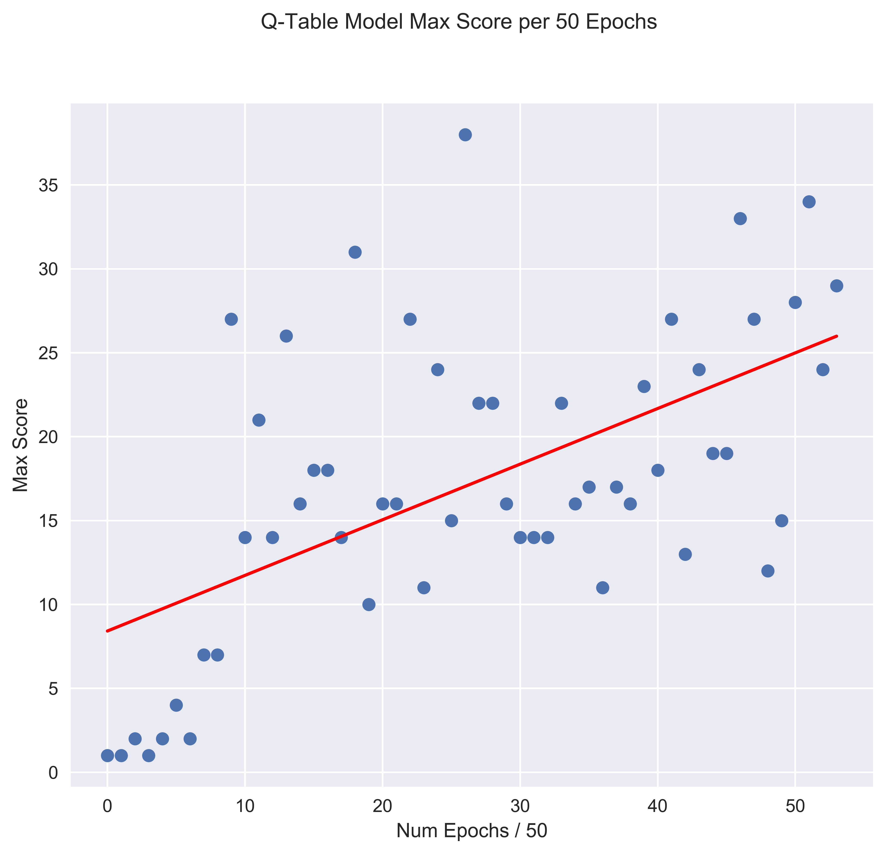
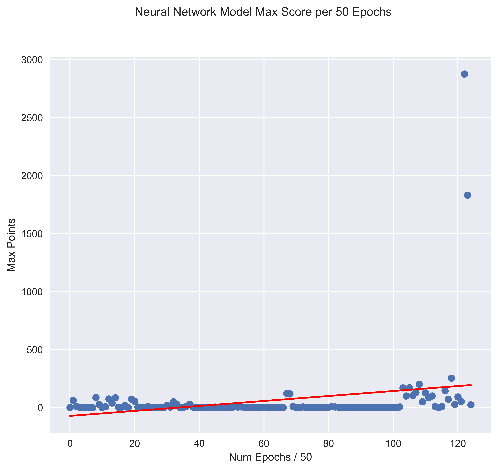

# FlappyBird.AI
This repository contains both QLearning (numpy) and Deep QLearning (keras) models that learn to play the popular mobile game FlappyBird.

The repo is broken up by the different models. With the model code being mostly contained in `model.py`, a class used to inject the model into `flappy.py`.

# Information
<object data="graphs_for_README/qlearning.png" type="application/pdf" width="700px" height="700px">
    <embed src="graphs_for_README/qlearning.png">
        
This browser does not support PDFs.

    </embed>
</object>

# QLearning Results

# DQN Results

## More to come in this area
Will contain specifics on QLearning 

## Inspiration & Credit:
* PyGame port of FlappyBird: [sourabhv](https://github.com/sourabhv/FlapPyBird)
* Inspiration from [maurock](https://github.com/maurock/snake-ga) and his Snake implementation of DQN

